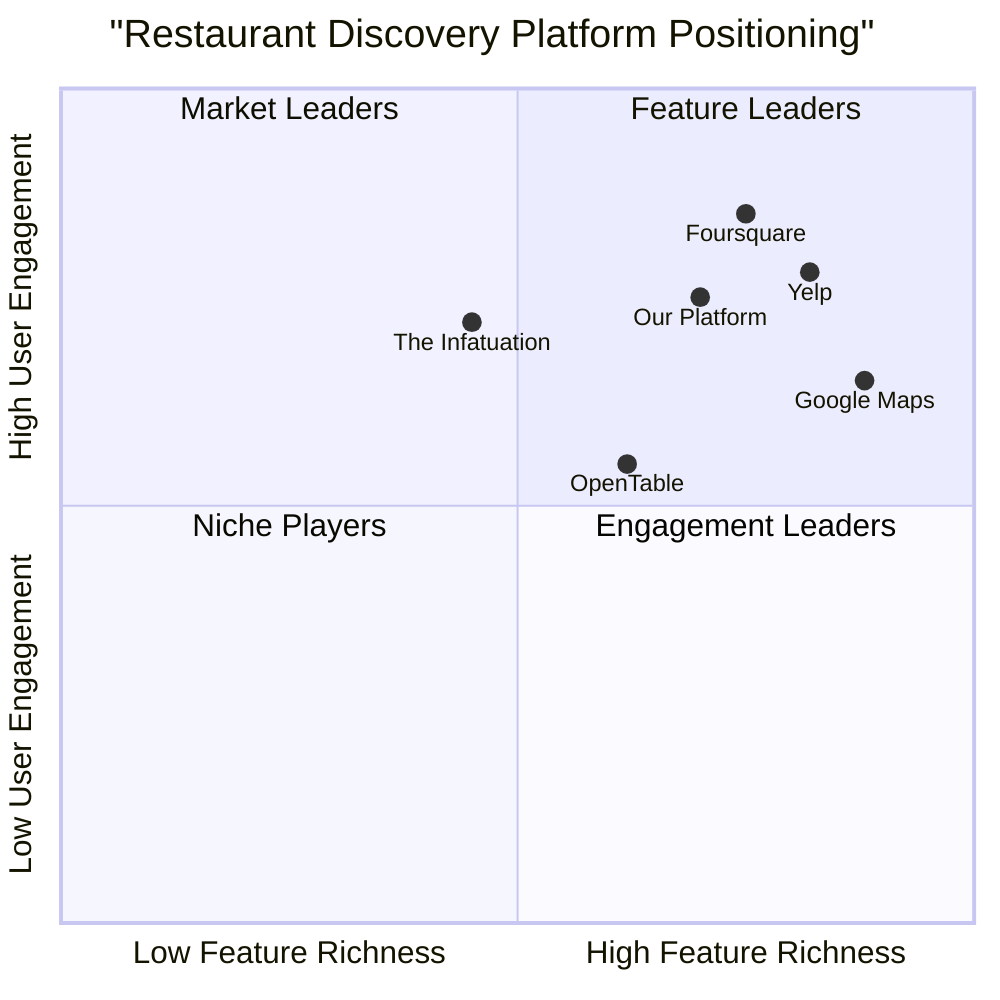

# Restaurant Discovery Web Application PRD

## 1. Project Overview

### 1.1 Project Information
- **Project Name**: restaurant_discovery_web
- **Platform**: Web Application
- **Technology Stack**: React, JavaScript, Tailwind CSS
- **Original Requirements**:
  - Restaurant search and filtering functionality
  - User reviews and ratings system
  - Location-based recommendations

### 1.2 Product Goals
1. Provide users with accurate and relevant restaurant recommendations based on their location and preferences
2. Build a trusted community-driven platform for authentic restaurant reviews and ratings
3. Create an intuitive and efficient restaurant search experience with smart filtering options

### 1.3 User Stories
1. As a hungry office worker, I want to quickly find nearby restaurants that match my dietary preferences and price range so that I can make an informed decision for my lunch break
2. As a food enthusiast, I want to share my dining experiences through detailed reviews and ratings so that I can help others discover great restaurants
3. As a tourist, I want to discover popular local restaurants in an unfamiliar area so that I can experience authentic local cuisine
4. As a regular user, I want to receive personalized restaurant recommendations based on my past preferences and ratings so that I can discover new places I might enjoy

## 2. Competitive Analysis

### 2.1 Market Overview
Key players in the restaurant discovery space include:

1. **Foursquare**
   - Pros:
     * Superior location accuracy and real-time popularity data
     * Strong personalization engine
     * Sophisticated location-based notifications
   - Cons:
     * Limited reservation features
     * Younger demographic focus limits broad appeal

2. **Yelp**
   - Pros:
     * Extensive user reviews and ratings
     * Comprehensive business information
     * Integrated reservation and delivery features
   - Cons:
     * Review reliability concerns
     * Complex interface

3. **Google Maps**
   - Pros:
     * Seamless integration with Google ecosystem
     * Excellent navigation features
     * Large user base
   - Cons:
     * Limited social features
     * Basic review system

4. **OpenTable**
   - Pros:
     * Strong reservation system
     * Rewards program
     * Direct booking integration
   - Cons:
     * Limited discovery features
     * Overwhelming options

5. **The Infatuation**
   - Pros:
     * Expert curated reviews
     * High-quality content
     * Focused recommendations
   - Cons:
     * Limited coverage
     * No native booking system

### 2.2 Competitive Positioning

## 3. Technical Specifications

### 3.1 Requirements Analysis

Core Technical Components:
1. Location Services
   - Real-time geolocation tracking
   - Proximity-based search
   - Location permission handling

2. Search & Filter System
   - Full-text search capability
   - Multiple filter combinations
   - Smart result ranking

3. Review System
   - User authentication
   - Media upload handling
   - Rating aggregation

### 3.2 Requirements Pool

#### P0 (Must-have)
- User location detection and permission management
- Restaurant search with basic filters (cuisine, price, distance)
- View restaurant details (photos, hours, contact info)
- Basic review and rating submission
- Mobile-responsive web design
- User authentication system
- Restaurant list view and map view

#### P1 (Should-have)
- Advanced search filters (dietary restrictions, features, etc.)
- Photo upload for reviews
- Personalized recommendations
- Save favorite restaurants
- Share restaurant details
- Sort options for search results
- Review helpfulness voting

#### P2 (Nice-to-have)
- Social features (follow users, friends' recommendations)
- Restaurant owner responses to reviews
- Integration with reservation systems
- Waiting time estimates
- Menu item recommendations
- Price range indicators

### 3.3 UI Design Draft

Key Screens:
1. Home/Discovery Page
   - Search bar with location input
   - Quick filters for common searches
   - Trending restaurants section
   - Personalized recommendations

2. Search Results Page
   - List/Map toggle view
   - Filter sidebar
   - Sort options
   - Restaurant cards with key info

3. Restaurant Detail Page
   - Photo gallery
   - Basic info section
   - Reviews section
   - Similar restaurants

4. Review Submission Page
   - Rating input
   - Photo upload
   - Review text editor
   - Guidelines sidebar

### 3.4 Open Questions

1. Technical Considerations
   - What is the expected initial user base size?
   - Should we implement our own review system or integrate with existing platforms?
   - What are the data storage requirements for user-generated content?

2. Business Considerations
   - Should we implement a restaurant owner portal?
   - What is the monetization strategy?
   - Should we integrate with third-party reservation systems?

3. User Experience
   - How to ensure review quality and prevent spam?
   - What metrics should determine restaurant rankings?
   - How to handle areas with limited restaurant data?

